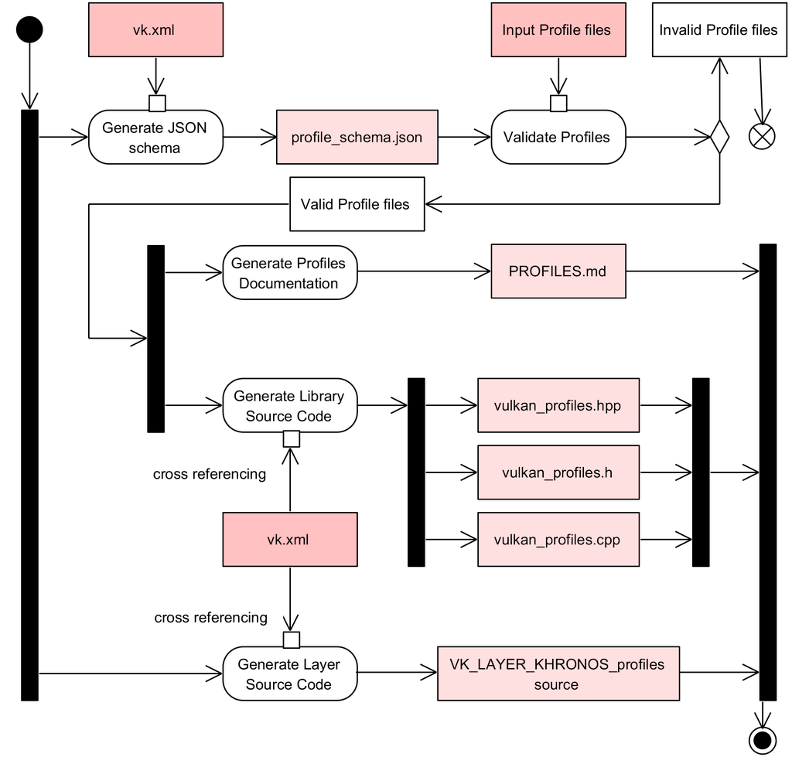

<!-- markdownlint-disable MD041 -->
<p align="left"></p>
<p align="left">Copyright © 2021-2022 LunarG, Inc.</p>

<p align="center"></p>

[![Creative Commons][3]][4]

[3]: https://i.creativecommons.org/l/by-nd/4.0/88x31.png "Creative Commons License"
[4]: https://creativecommons.org/licenses/by-nd/4.0/

# Vulkan Profiles Tools Overview

The *Vulkan Profiles Tools* are a collection of components for Vulkan application developers to build **portable** Vulkan applications thanks to *Vulkan Profiles*.

All *the Vulkan Profiles Tools* remains under development and are delivered as part of the [***Vulkan SDK***](https://www.lunarg.com/vulkan-sdk/) under the **BETA** status.

## Vulkan Profiles Tools Components

The *Vulkan Profiles Tools* are the following components:
- ***The Vulkan Profiles JSON Schemas***
  - A data format to exchange Vulkan Capabilities: extensions, features, properties and formats.
  - Each revision of Vulkan API is represented by a schema that supersed older version of Vulkan API.
- [***The Vulkan Profiles API library***](./library/TUTORIAL.md)
  -  A header-only C++ library to use Vulkan Profiles in Vulkan applications compatible with Vulkan 1.0 + `VK_KHR_get_physical_device_properties2` drivers.
- [***The Vulkan Profiles Layer***](./layer/TUTORIAL.md)
  - A layer to help developing Vulkan Applications which respect the requirements of a chosen *Vulkan Profile*.
- [***The Vulkan Profiles Documentation***](./PROFILES.md)
  - A table to compare *Vulkan Profiles* capabilities against each other.

## Vulkan Profiles Tools Code Generation

The *Vulkan Profiles Tools* interpret the concept of *Vulkan Profiles* as a concept that can be appropriated by any member of the Vulkan ecosystem.
As a result, *Vulkan Profiles* can serve multiple use case:
- *Roadmap profiles*: To express guidance on the future direction of Vulkan devices.
- *Platform profiles*: To express the Vulkan support available on different platforms.
- *Device profiles*: To express the Vulkan support of a single Vulkan driver for a Vulkan device.
- *Engine profiles*: To express some rendering code paths requirements of an engine.
- Etc.

As a result, the *Vulkan Profiles Tools* are generated against [`vk.xml`](https://github.com/KhronosGroup/Vulkan-Headers/blob/main/registry/vk.xml)(the canonical representation of the Vulkan specification) and [*Vulkan Profiles*](https://github.com/KhronosGroup/Vulkan-Profiles/tree/master/profiles) written against the Vulkan Profiles JSON Schemas.
This design allows any Vulkan developer to regenerate the entier *Vulkan Profiles Tools* solution with any [Vulkan Header](https://github.com/KhronosGroup/Vulkan-Headers) update and with Vulkan developer-defined profiles.



## Future Work:
  - [GPUInfo.org](https://gpuinfo.org/) will allow downloading profiles files for any Vulkan drivers report.
  - [`vulkaninfo`](https://vulkan.lunarg.com/doc/view/latest/windows/vulkaninfo.html) will allow generating profiles files.
  - The [Khronos Vulkan-Samples](https://github.com/KhronosGroup/Vulkan-Samples) repository will include a sample that use the *Vulkan Profiles API Library*.

## The Vulkan Profiles JSON Schema

```
{
    "$schema": "https://schema.khronos.org/vulkan/profiles-1.3.204.json#",
    "capabilities": {
        "baseline": {},
        "advanced": {}
    },
    "profiles": {
        "VP_LUNARG_test_structure_simple": {
            "version": 1,
            "api-version": "1.2.198",
            "label": "LunarG Profiles Structure unit test",
            "description": "For schema unit test on C.I.",
            "contributors": {
                "Christophe Riccio": {
                    "company": "LunarG",
                    "email": "christophe@lunarg.com",
                    "github": "christophe-lunarg",
                    "contact": true
                }
            },
            "history": [
                {
                    "revision": 1,
                    "date": "2021-12-08",
                    "author": "Christophe Riccio",
                    "comment": "Initial revision"
                }
            ],
            "capabilities": [
                "baseline"
            ]
        }
    }
}
```
